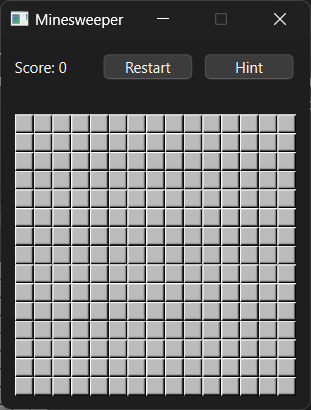
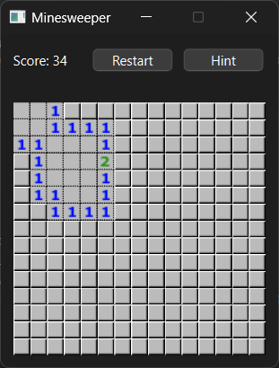
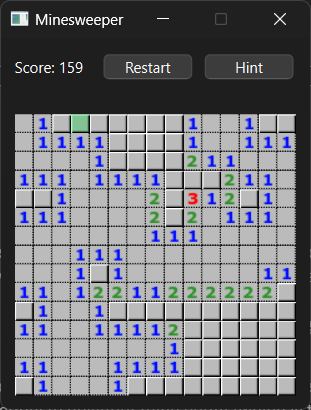
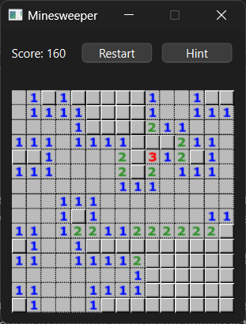

# CMPE 230 – Project 3

## Overview

This project is an implementation of the “Minesweeper” game in C++ using Qt framework. It mainly consists of 3 parts: cells, grid, displaying buttons and the layout. The core functionality of the game is handled in the grid class. The grid has cells in its rows and columns, and cells can be accessed in the grid.

## Cell

The cell class has 2 main functions: reveal cell and flag cell. Reveal cell function, marks the cell as revealed and displays appropriate icon according to neighbor mines. If the clicked cell is a mine, it triggers game over signal with lose as parameter and displays lose game message box. Flag cell function marks the cell as flagged and displays the flag icon for that cell. The flags do not really affect gameplay, they are just markers for the player.

## Grid

Main game logic is handled in this class. One of the important functions in this class is revealCells which is called when a cell is clicked. It reveals the cell on given coordinates and if that cell is not a mine and has zero neighbor mines, it reveals it neighbors until it reaches a cell with non-zero neighbor mines count. It uses the BFS algorithm to accomplish this. If all the cells which are not mined are revealed, it triggers game over signal with win as parameter this time and displays the win message box.

    
    

 Clicking on (3, 3) 

Another key part of this project is the hint function. This function finds a “safe” cell which is deducible by the player as well and displays it green indicating it is safe to reveal that cell. When the hint button is clicked twice in a row, it reveals the last given hint cell. This function never shows a mined cell as hint. It always finds safe cells that are logically findable by the player using the information on the grid.
To achieve this, it loops over currently revealed cells and looks at its neighbors. If a cell’s unrevealed neighbor count is equal to neighbor mine count (which is the value displayed on screen), all those unrevealed neighbors are mines. So, it “marks” those cells as mines, it adds them to a hash set which holds the marked cells. If a cell’s marked neighbor count (calculated using the hash set from before) is equal to neighbor mine count, it is guaranteed that all other neighbors (unrevealed and not marked) are not mines. Therefore, it shows one of them as hint. It does this marking process until there are no changes in the marked cells hash set. This ensures that it marks all the cells it can mark given the information on the screen. Of course, there are situations which this algorithm may fail to find a hint given a complicated grid. However, it never shows a wrong hint or gives information which the player can’t deduce.

    
    

For example, in this case, it shows (1, 4) as a safe cell. Because the cell in (2, 2) should have its mine at (1, 3). Cell in (2, 4) has 1 neighbor mine, so (1, 4) and (1, 5) are not mines. When the hint button is clicked again, it reveals that cell.

## Displaying the buttons and the layout

Layout of the game consists of two main parts: navbar at the top and the grid. There is a score label on the navbar which simply displays the number of revealed cells. We used a custom signal to trigger an update on the label every time a cell is revealed. There is a reset button on the navbar which resets everything back to the default and randomly places mines again. We used the clicked signal on the button to trigger the reset function in the grid. The hint button is implemented in a similar way.

For the clicking operations of cells, again we used the clicked signal to trigger the corresponding slot function in the cell. However, since reveal function needs to be able to access its neighbors as well, we held a pointer to the grid in cells to call the revealCells function in the grid. We used the function mousePressEvent to handle the right click (to put flags).

There are parameters in the main.cpp file for configuration. N, M and K variables indicating row count, column count and mine count respectively.
